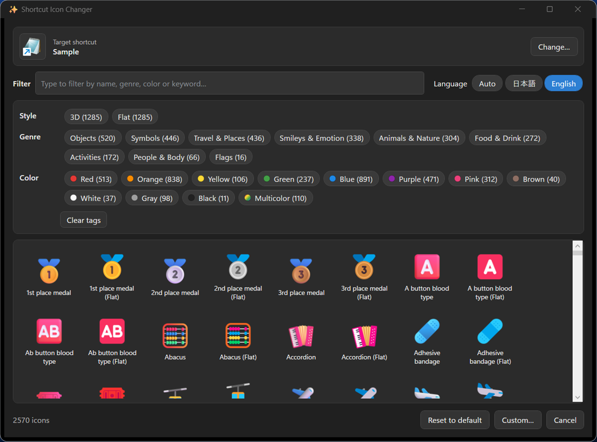
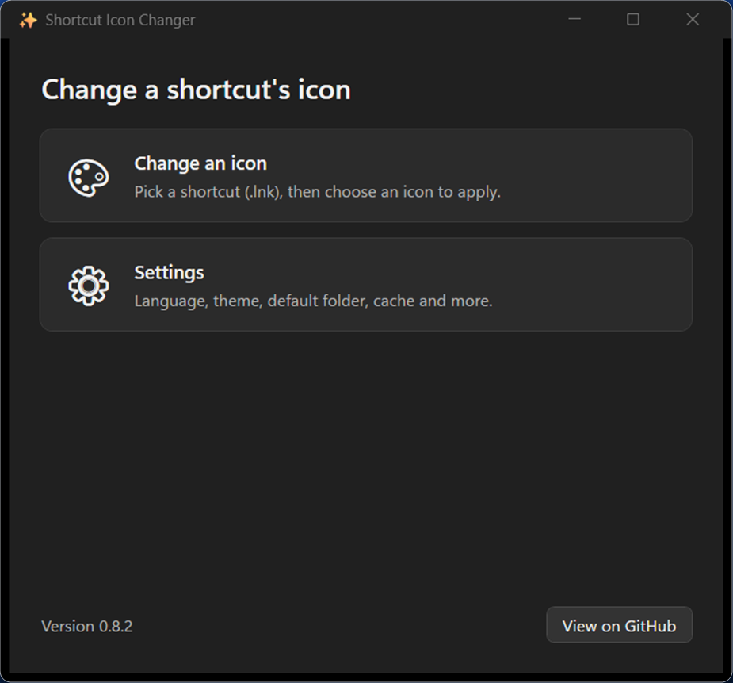
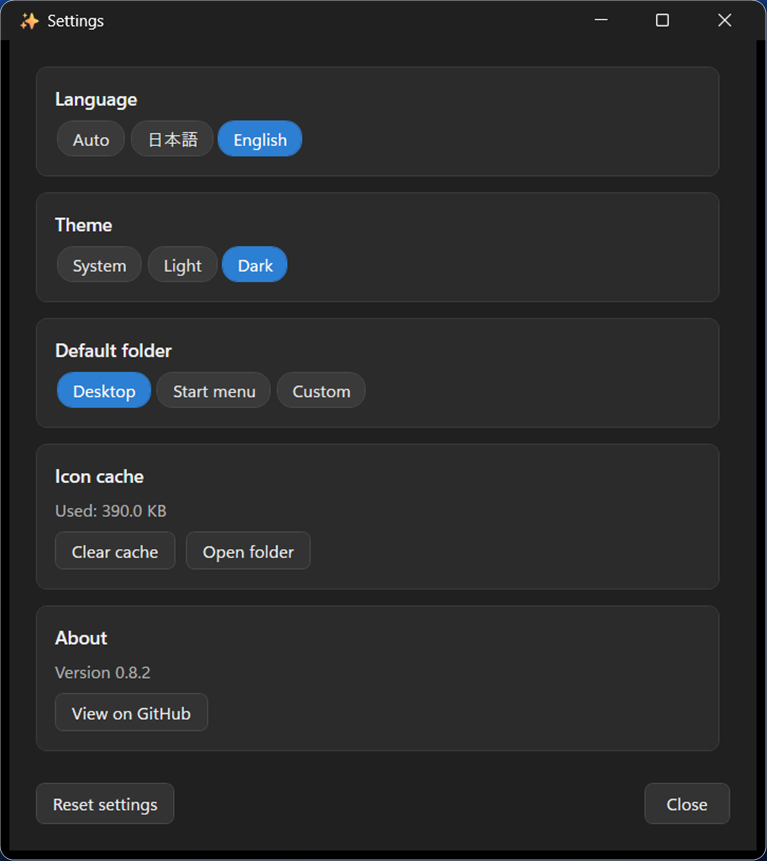

**English** | [日本語](README.ja.md)

# shortcut-icon-changer

A tool for changing the icon of a Windows shortcut (`.lnk`) quickly and colorfully, right from the context menu. The icons shipped with Windows (imageres.dll / shell32.dll) share a uniform color scheme and are limited in number, which makes shortcuts hard to tell apart at a glance — this tool solves that.

> Status: **v0.8.2** — native app + per-user MSI installer. It includes a Home screen, Settings, and Light / Dark themes, and optionally supports the **Windows 11 modern context menu**. **Microsoft Store distribution is in preparation.** It runs using only built-in Windows 10 / 11 features — no extra runtime to install, no build, and no signing required.

## Screenshots

The icon picker opens from the context menu. It shows the target shortcut and its current icon at the top, and lets you filter roughly 2,570 icons by style / genre / color tags or by keyword.



| Home screen (launched from the Start menu) | Settings (language, theme, folder, cache) |
| :---: | :---: |
|  |  |

## Features

- Change the icon of a `.lnk` with just a right-click → "Change icon".
- **Optional support for the Windows 11 modern (top-level) context menu** — opt in via a checkbox during MSI installation to run "Change icon" from the top level without opening "Show more options". Because it uses a self-signed sparse MSIX, a one-time certificate-trust elevation (per machine, requires administrator) is needed only when you enable it. If you leave it off, you can still use the app as before from the legacy menu (under "Show more options").
- Built-in colorful icon source: nearly the entire **Microsoft Fluent UI Emoji (MIT)** set. **Two styles — 3D and Flat — totaling roughly 2,570 icons** are bundled in a single `icons.zip`, so you can pick one immediately with no internet connection (High Contrast is excluded as it is rarely used). The list is drawn with **row-level UI virtualization**, so startup stays fast even with a large catalog.
- **Filter with a tag cloud of style / genre / color** — click a tag at the top of the picker to show only matching icons. Each row (style / genre / color) is **single-select**: pressing another tag switches the selection within that row, and pressing the same tag again clears it. Combinations across rows (e.g., style × genre × color) are combined with AND.
- A **keyword search box at the top** searches across names, genres, styles, and keywords (can be combined with the tag cloud).
- **"Reset to default"** restores the original (target's own) icon in one click.
- **Light / Dark / Follow-system themes** are supported across the entire app.
- You can also specify your own `.ico` / `.png` (PNG is converted to `.ico` on the fly).
- **No extra runtime required**: it runs on only the **.NET Framework 4.8 (WPF, System.Drawing)** that ships with Windows 10 / 11. There is nothing for end users to install separately.
- No administrator rights required (registered per user under `HKCU`).

## Requirements

- Windows 10 version 22H2, or Windows 11
- No additional installation (built-in Windows features only)
- The "Change icon" context-menu entry works on both Windows 10 and 11. The **modern (top-level) context menu is Windows 11 only**; on Windows 10 you use it from the conventional context menu as before.

## Installation

Get `ShortcutIconChanger-X.Y.Z-perUser.msi` from [Releases](https://github.com/kemaruya/shortcut-icon-changer/releases) and double-click to install (silent: `msiexec /i ShortcutIconChanger-0.8.2-perUser.msi /qn`). No administrator rights or UAC are required. It is installed to `%LOCALAPPDATA%\Programs\ShortcutIconChanger`, and "Change icon" is registered in the `.lnk` context menu.

On the finish screen of the installer you can choose whether to enable the **modern context menu** (off by default). When enabled, you can run "Change icon" directly from the Windows 11 top-level menu (only then does a one-time administrator elevation occur, to trust the certificate).

To uninstall, use "Apps & features", or run silently: `msiexec /x ShortcutIconChanger-0.8.2-perUser.msi /qn`.

## Usage

- **From the context menu**: right-click any `.lnk` → "Change icon" (under "Show more options" if you have not enabled the modern menu). The picker opens with the target shortcut and its current icon shown at the top. Select an icon to apply it, or use "Reset to default" to restore the original.
- **From the Start menu**: launch "Shortcut Icon Changer" to open the Home screen. Use "Change icon" to pick a target `.lnk` and change it, and use "Settings" to manage language, theme, the default folder, and the cache.

## Command-line usage (no UI)

The installed `ShortcutIconChanger.exe` (by default `%LOCALAPPDATA%\Programs\ShortcutIconChanger\ShortcutIconChanger.exe`) can apply or reset an icon via arguments, without going through the UI.

```powershell
$exe = "$env:LOCALAPPDATA\Programs\ShortcutIconChanger\ShortcutIconChanger.exe"

# Apply an icon (PNG is converted to .ico on the fly)
& $exe -Lnk "C:\path\to\App.lnk" -IconPath "C:\path\to\icon.png"

# Reset the icon to default (the target's own)
& $exe -Lnk "C:\path\to\App.lnk" -Reset

# Open the picker with a target .lnk (with UI)
& $exe "C:\path\to\App.lnk"
```

Launching with no arguments opens the Home screen. The `.lnk` path can be given either as a positional argument or with `-Lnk`.

## Changelog (main changes)

- **v0.8.2** — **Official support for Windows 10 (22H2)**. So that the context-menu icon displays correctly on Windows 10, the app now self-heals the right-click verb registration (icon, label, command) on startup to match the running executable, and refreshes the shell icon cache. As a result, even if an icon was broken by a stale registration or cache from an older version, it is fixed on first launch. Enabling the modern context menu (Windows 11 only) is automatically skipped on Windows 10.
- **v0.8.1** — The Settings screen now expands automatically to fit its content, fixing an issue where items were clipped. Added screenshots to the repository.
- **v0.8.0** — Added a **Home screen** and a **Settings screen** (language, theme, default folder, cache) that can be launched from the Start menu. Added app-wide **Light / Dark / Follow-system themes**. Added a **target bar** to the picker (the `.lnk` name being changed and the current icon), making it clear when no target is selected (e.g., when opened from Home). Changed the splash to a **deferred-gate style** that appears only when rendering is actually slow. Added a **full MSIX build for Microsoft Store distribution**.
- **v0.7.0** — **Optional Windows 11 modern context menu support**. A native COM handler implementing `IExplorerCommand` (C++, no extra runtime) is bundled as a self-signed sparse MSIX, and can be opted into from the MSI finish screen.
- **v0.6.x** — Bundled nearly the entire Fluent UI Emoji set as **roughly 2,570 icons across 3D and Flat** (a single `icons.zip`). Sped up startup by applying **row-level UI virtualization** to the list. Reorganized the tag cloud into **single-select within a row + AND across rows**.
- **v0.5.x** — Became a **native app + per-user MSI**. **Japanese / English localization** (UI text and icon display names). Improved perceived startup (splash, split loading of icons).

## Building (for developers)

```powershell
# Release build → staging → generate MSI with WiX
powershell.exe -ExecutionPolicy Bypass -File .\build\Build-Phase2.ps1
# → outputs dist\ShortcutIconChanger-X.Y.Z-perUser.msi (-RunTests also runs the Core tests)
```

> Building requires Visual Studio 2022/2026 (MSBuild) and the WiX 6 global tool (`dotnet tool install --global wix`). Neither is needed in the end-user runtime environment.

## Architecture / design

See [docs/architecture.md](docs/architecture.md). It summarizes the design: a native WPF app + a WiX per-user MSI + Japanese / English i18n.

## License

- Code in this repository: [MIT](LICENSE)
- Bundled / fetched icons: Microsoft Fluent UI Emoji (MIT). See [THIRD-PARTY-NOTICES.md](THIRD-PARTY-NOTICES.md).
