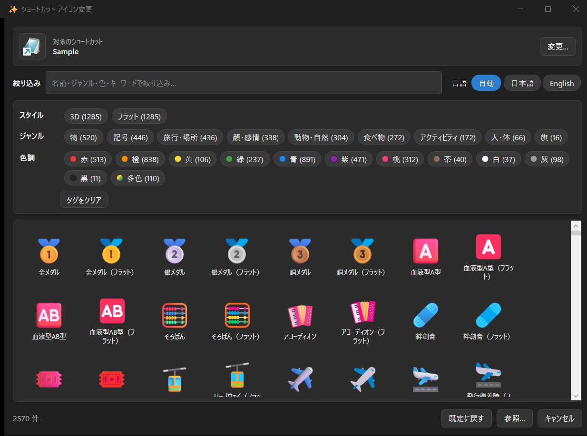
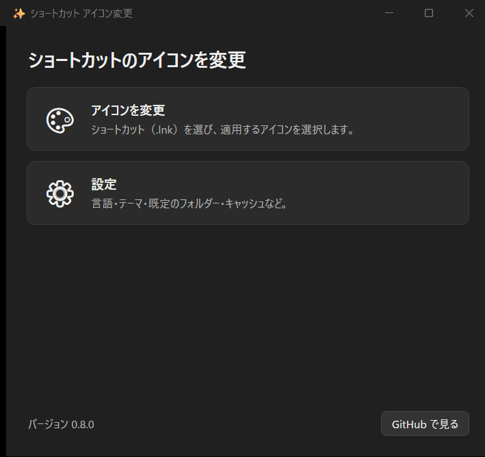
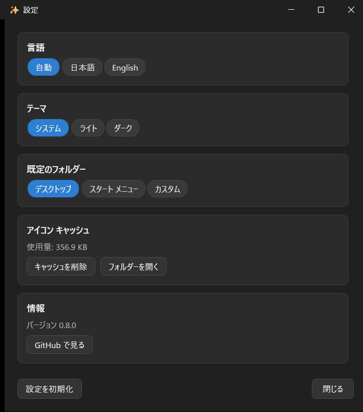

# shortcut-icon-changer

Windows のショートカット (`.lnk`) のアイコンを、右クリックメニューから手軽に・カラフルに変更するツールです。OS 標準アイコン (imageres.dll / shell32.dll) は色調が統一されていて数も限られるため、内容を見た目で判断しづらいという課題を解決します。

> 状態: **v0.8.1** — ネイティブ アプリ + ユーザー単位 MSI インストーラー。ホーム画面・設定・ライト / ダーク テーマに対応し、**Windows 11 のモダン コンテキスト メニュー**にも任意で対応します。**Microsoft Store 配布を準備中**です。Windows 11 標準機能のみで動作し、追加ランタイムのインストール・ビルド・署名は不要です。

## スクリーンショット

右クリックメニューから開くアイコン ピッカー。対象のショートカットと現在のアイコンを上部に表示し、約 2,570 種をスタイル・ジャンル・色調のタグやキーワードで絞り込めます。



| ホーム画面（スタート メニューから起動） | 設定（言語・テーマ・フォルダー・キャッシュ） |
| :---: | :---: |
|  |  |

## 特長

- 右クリック →「アイコンを変更」だけで `.lnk` のアイコンを変更できます。
- **Windows 11 のモダン（第一階層）右クリックメニューに対応（任意）** — MSI インストール時のチェックボックスでオプトインすると、「その他のオプションを表示」を開かずに第一階層から「アイコンを変更」を実行できます。自己署名スパース MSIX を使うため、有効化時のみ証明書信頼の昇格（管理者・機械ごとに一度）が必要です。オフのままでもレガシー メニュー（「その他のオプションを表示」配下）から従来どおり利用できます。
- カラフルなアイコン源として **Microsoft Fluent UI Emoji (MIT)** のほぼ全種を内蔵。**3D・フラットの 2 スタイル・計 約 2,570 種**を単一の `icons.zip` に同梱しており、ネット接続なしですぐ選べます（ハイコントラストは使用率が低いため同梱対象外）。一覧は**行単位の UI 仮想化**で描画するため、搭載数が多くても起動は高速です。
- **スタイル・ジャンル・色調のタグクラウドで絞り込み** — ピッカー上部のタグをクリックすると一致するアイコンだけを表示します。各行（スタイル / ジャンル / 色）は**単一選択**で、別のタグを押すと同じ行内で選択が切り替わり、同じタグをもう一度押すと解除されます。行をまたいだ組み合わせ（例: スタイル×ジャンル×色）は AND で併用できます。
- **上部のキーワード検索ボックス**で名前・ジャンル・スタイル・キーワードを横断検索できます（タグクラウドと併用可）。
- **「既定に戻す」** ワンクリックで元の（ターゲット本来の）アイコンに戻せます。
- **ライト / ダーク / システム追従のテーマ**にアプリ全体で対応します。
- ユーザー独自の `.ico` / `.png` も指定できます（PNG はその場で `.ico` 化）。
- **追加ランタイム不要**: Windows 11 に標準同梱の **.NET Framework 4.8（WPF, System.Drawing）** のみで動作します。エンドユーザーが別途インストールするものはありません。
- 管理者権限不要（`HKCU` にユーザー単位で登録）。

## 動作要件

- Windows 11（21H2 以降）
- 追加インストール不要（Windows 同梱機能のみ）

## インストール

[Releases](https://github.com/kemaruya/shortcut-icon-changer/releases) から `ShortcutIconChanger-X.Y.Z-perUser.msi` を入手し、ダブルクリックでインストールします（サイレントは `msiexec /i ShortcutIconChanger-0.8.1-perUser.msi /qn`）。管理者権限・UAC は不要です。`%LOCALAPPDATA%\Programs\ShortcutIconChanger` に導入され、`.lnk` の右クリックメニューに「アイコンを変更」が登録されます。

インストール時の終了画面で**モダン コンテキスト メニュー**を有効化するか選べます（既定オフ）。有効化すると Windows 11 の第一階層メニューから直接「アイコンを変更」を実行できます（このときだけ、証明書信頼のため一度だけ管理者昇格が入ります）。

アンインストールは「アプリと機能」から、またはサイレントに `msiexec /x ShortcutIconChanger-0.8.1-perUser.msi /qn` で行えます。

## 使い方

- **右クリックから**: 任意の `.lnk` を右クリック →「アイコンを変更」（モダン メニューを有効化していない場合は「その他のオプションを表示」配下）。ピッカーが開き、対象のショートカットと現在のアイコンが上部に表示されます。アイコンを選んで適用、または「既定に戻す」で元に戻せます。
- **スタート メニューから**: 「Shortcut Icon Changer」を起動するとホーム画面が開きます。「アイコンを変更」から対象の `.lnk` を選んで変更でき、「設定」で言語・テーマ・既定のフォルダー・キャッシュを管理できます。

## コマンドラインでの利用（UI なし）

インストール先の `ShortcutIconChanger.exe`（既定では `%LOCALAPPDATA%\Programs\ShortcutIconChanger\ShortcutIconChanger.exe`）は、引数で UI を介さずに適用・リセットできます。

```powershell
$exe = "$env:LOCALAPPDATA\Programs\ShortcutIconChanger\ShortcutIconChanger.exe"

# アイコンを適用（PNG はその場で .ico 化）
& $exe -Lnk "C:\path\to\App.lnk" -IconPath "C:\path\to\icon.png"

# アイコンを既定（ターゲット本来）に戻す
& $exe -Lnk "C:\path\to\App.lnk" -Reset

# 対象 .lnk を渡してピッカーを開く（UI あり）
& $exe "C:\path\to\App.lnk"
```

引数なしで起動するとホーム画面が開きます。`.lnk` のパスは位置引数でも `-Lnk` でも指定できます。

## 更新履歴（主な変更）

- **v0.8.1** — 設定画面が内容の高さに合わせて自動的に広がるようになり、項目が見切れる問題を修正。リポジトリにスクリーンショットを追加。
- **v0.8.0** — スタート メニューから起動できる**ホーム画面**と**設定画面**（言語・テーマ・既定のフォルダー・キャッシュ）を追加。アプリ全体で**ライト / ダーク / システム追従のテーマ**に対応。ピッカーに**対象バー**（変更対象の `.lnk` 名と現在のアイコン）を追加し、ホームから開いた場合は対象が未選択であることを明示。スプラッシュを**遅延ゲート式**に変更し、実際に描画が遅いときだけ表示。**Microsoft Store 配布用の完全 MSIX** ビルドを追加。
- **v0.7.0** — **Windows 11 モダン コンテキスト メニュー対応（任意）**。`IExplorerCommand` を実装したネイティブ COM ハンドラ（C++・追加ランタイム不要）を自己署名スパース MSIX として同梱し、MSI の終了画面でオプトイン有効化できます。
- **v0.6.x** — Fluent UI Emoji のほぼ全種を **3D・フラットの計 約 2,570 種**として同梱（単一 `icons.zip`）。一覧を**行単位で UI 仮想化**して起動を高速化。タグクラウドを**行内単一選択 + 行またぎ AND**に整理。
- **v0.5.x** — **ネイティブ アプリ + ユーザー単位 MSI** 化。**日本語 / 英語の多言語対応**（UI 文言・アイコン表示名）。起動体感の改善（スプラッシュ・アイコンの分割読み込み）。

## ビルド（開発者向け）

```powershell
# Release ビルド → ステージング → WiX で MSI 生成
powershell.exe -ExecutionPolicy Bypass -File .\build\Build-Phase2.ps1
# → dist\ShortcutIconChanger-X.Y.Z-perUser.msi を出力（-RunTests で Core テストも実行）
```

> ビルドには Visual Studio 2022/2026（MSBuild）と WiX 6 グローバル ツール（`dotnet tool install --global wix`）が必要です。エンドユーザーの実行環境には不要です。

## アーキテクチャ / 設計

[docs/architecture.md](docs/architecture.md) を参照してください。ネイティブ WPF アプリ + WiX ユーザー単位 MSI + 日本語 / 英語 i18n の構成をまとめています。

## ライセンス

- 本リポジトリのコード: [MIT](LICENSE)
- 同梱・取得するアイコン: Microsoft Fluent UI Emoji (MIT)。[THIRD-PARTY-NOTICES.md](THIRD-PARTY-NOTICES.md) を参照。
